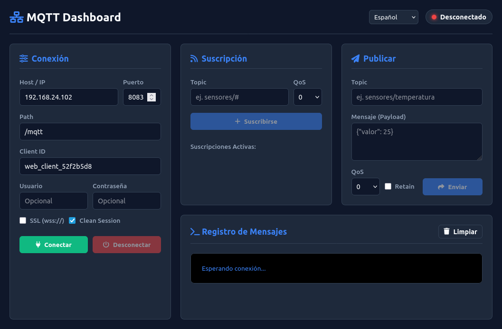

# Simple MQTT Web Client

Otro cliente MQTT por WebSockets. Nada nuevo bajo el sol, pero está todo contenido en un solo archivo HTML y visualmente cumple. Útil para salir del paso.

🔗 **[Ver la aplicación en vivo (GitHub Pages)](https://soyunomas.github.io/simple-mqtt-web-client/)**

## Características

- **Autocontenido**: Un único archivo `index.html`. Cero instalación, sin *node_modules* ni procesos de build. Usa [MQTT.js](https://github.com/mqttjs/MQTT.js) por CDN.
- **Multi-idioma**: Soporta Español (por defecto), Inglés, Portugués, Francés, Alemán y Chino. Se cambia al vuelo.
- **Conexión**: Permite WebSockets estándar (`ws://`) y seguros (`wss://`).
- **Suscripción y Publicación**: Gestión de múltiples topics activos, soporte para niveles QoS (0, 1, 2) y mensajes retenidos (*Retain*).
- **Consola**: Registro de eventos con diferenciación visual entre mensajes enviados (📤) y recibidos (📥).
- **Diseño**: Interfaz en modo oscuro, limpia y 100% responsive.

## Uso

Abre el enlace de GitHub Pages de arriba, o descarga el archivo `index.html` a tu ordenador y ábrelo con cualquier navegador.
